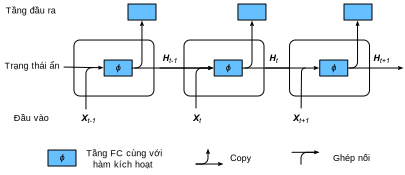

<!-- ===================== Bắt đầu dịch Phần 1 ==================== -->
<!-- ========================================= REVISE PHẦN 1 - BẮT ĐẦU =================================== -->

<!--
# Recurrent Neural Networks
-->

# Mạng nơ-ron Hồi tiếp
:label:`sec_plain_rnn`

<!--
In :numref:`sec_language_model` we introduced $n$-gram models, where the conditional probability of word $x_t$ at position $t$ only depends on the $n-1$ previous words.
If we want to check the possible effect of words earlier than $t-(n-1)$ on $x_t$, we need to increase $n$.
However, the number of model parameters would also increase exponentially with it, as we need to store $|V|^n$ numbers for a vocabulary $V$.
Hence, rather than modeling $p(x_t \mid x_{t-1}, \ldots, x_{t-n+1})$ it is preferable to use a *latent variable model* in which we have
-->

:numref:`sec_language_model` đã giới thiệu mô hình $n$-gram, trong đó xác suất có điều kiện của từ $x_t$ tại vị trí $t$ chỉ phụ thuộc vào $n-1$ từ trước đó.
Nếu muốn kiểm tra ảnh hưởng có thể có của các từ ở trước vị trí $t-(n-1)$ đến từ $x_t$, ta cần phải tăng $n$.
Tuy nhiên, cùng với đó số lượng tham số của mô hình cũng sẽ tăng lên theo hàm mũ, vì ta cần lưu $|V|^n$ giá trị với một từ điển $V$ nào đó.
Do đó, thay vì mô hình hóa $p(x_t \mid x_{t-1}, \ldots, x_{t-n+1})$, sẽ tốt hơn nếu ta sử dụng *mô hình biến tiềm ẩn* (*latent variable model*), trong đó

$$p(x_t \mid x_{t-1}, \ldots, x_1) \approx p(x_t \mid x_{t-1}, h_{t}).$$

<!--
Here $h_t$ is a *latent variable* that stores the sequence information.
A latent variable is also called as *hidden variable*, *hidden state* or *hidden state variable*.
The hidden state at time $t$ could be computed based on both input $x_{t}$ and hidden state $h_{t-1}$, that is
-->

$h_t$ được gọi là *biến tiềm ẩn* và nó lưu trữ thông tin của chuỗi.
Biến tiềm ẩn còn được gọi là *biến ẩn* (*hidden variable*), *trạng thái ẩn* (*hidden state*) hay *biến trạng thái ẩn* (*hidden state variable*).
Trạng thái ẩn tại thời điểm $t$ có thể được tính dựa trên cả đầu vào $x_{t}$ và trạng thái ẩn $h_{t-1}$ như sau 

$$h_t = f(x_{t}, h_{t-1}).$$

<!--
For a sufficiently powerful function $f$, the latent variable model is not an approximation.
After all, $h_t$ could simply store all the data it observed so far.
We discussed this in :numref:`sec_sequence`.
But it could potentially makes both computation and storage expensive.
-->

Với một hàm $f$ đủ mạnh, mô hình biến tiềm ẩn không phải là một phép xấp xỉ.
Sau cùng, $h_t$ có thể chỉ đơn thuần lưu lại tất cả dữ liệu đã quan sát được cho đến thời điểm hiện tại.
Điều này đã được thảo luận tại :numref:`sec_sequence`.
Tuy nhiên nó có thể khiến cho việc tính toán và lưu trữ trở nên nặng nề.

<!--
Note that we also use $h$ to denote by the number of hidden units of a hidden layer.
Hidden layers and hidden states refer to two very different concepts.
Hidden layers are, as explained, layers that are hidden from view on the path from input to output.
Hidden states are technically speaking *inputs* to whatever we do at a given step.
Instead, they can only be computed by looking at data at previous iterations.
In this sense they have much in common with latent variable models in statistics, such as clustering or topic models where the clusters affect the output but cannot be directly observed.
-->

Chú ý rằng ta cũng sử dụng $h$ để kí hiệu số lượng nút ẩn trong một tầng ẩn.
Tầng ẩn và trạng thái ẩn là hai khái niệm rất khác nhau.
Tầng ẩn, như đã được giải thích, là các tầng không thể nhìn thấy trong quá trình đi từ đầu vào đến đầu ra.
Trạng thái ẩn, về mặt kỹ thuật là *đầu vào* của một bước tính toán tại một thời điểm xác định.
Chúng chỉ có thể được tính dựa vào dữ liệu tại các vòng lặp trước đó.
Về điểm này, trạng thái ẩn giống với các mô hình biến tiềm ẩn trong thống kê như mô hình phân cụm hoặc mô hình chủ đề (*topic model*), trong đó các cụm tác động đến đầu ra nhưng không thể quan sát trực tiếp.

<!--
Recurrent neural networks are neural networks with hidden states.
Before introducing this model, let us first revisit the multi-layer perceptron introduced in :numref:`sec_mlp`.
-->

Mạng nơ-ron hồi tiếp là mạng nơ-ron với các trạng thái ẩn.
Trước khi tìm hiểu mô hình này, hãy cùng xem lại perceptron đa tầng tại :numref:`sec_mlp`.

<!-- ===================== Kết thúc dịch Phần 1 ===================== -->

<!-- ===================== Bắt đầu dịch Phần 2 ===================== -->

<!--
## Recurrent Networks Without Hidden States
-->

## Mạng Hồi tiếp không có Trạng thái ẩn

<!--
Let us take a look at a multilayer perceptron with a single hidden layer.
Given a minibatch of the instances $\mathbf{X} \in \mathbb{R}^{n \times d}$ with sample size $n$ and $d$ inputs.
Let the hidden layer's activation function be $\phi$.
Hence, the hidden layer's output $\mathbf{H} \in \mathbb{R}^{n \times h}$ is calculated as
-->

Xét một perception đa tầng với một tầng ẩn duy nhất.
Giả sử ta có một minibatch $\mathbf{X} \in \mathbb{R}^{n \times d}$ với $n$ mẫu và $d$ đầu vào.
Gọi hàm kích hoạt của tầng ẩn là $\phi$.
Khi đó, đầu ra của tầng ẩn $\mathbf{H} \in \mathbb{R}^{n \times h}$ được tính như sau

$$\mathbf{H} = \phi(\mathbf{X} \mathbf{W}_{xh} + \mathbf{b}_h).$$

:eqlabel:`rnn_h_without_state`

<!--
Here, we have the weight parameter $\mathbf{W}_{xh} \in \mathbb{R}^{d \times h}$, bias parameter $\mathbf{b}_h \in \mathbb{R}^{1 \times h}$, and the number of hidden units $h$, for the hidden layer.
-->

Trong đó, $\mathbf{W}_{xh} \in \mathbb{R}^{d \times h}$ là tham số trọng số, $\mathbf{b}_h \in \mathbb{R}^{1 \times h}$ là hệ số điều chỉnh và $h$ là số nút ẩn của tầng ẩn.

<!--
The hidden variable $\mathbf{H}$ is used as the input of the output layer.
The output layer is given by
-->

Biến ẩn $\mathbf{H}$ được sử dụng làm đầu vào của tầng đầu ra.
Tầng đầu ra được tính toán bởi

$$\mathbf{O} = \mathbf{H} \mathbf{W}_{hq} + \mathbf{b}_q.$$

<!--
Here, $\mathbf{O} \in \mathbb{R}^{n \times q}$ is the output variable, 
$\mathbf{W}_{hq} \in \mathbb{R}^{h \times q}$ is the weight parameter, and $\mathbf{b}_q \in \mathbb{R}^{1 \times q}$ is the bias parameter of the output layer.
If it is a classification problem, we can use $\text{softmax}(\mathbf{O})$ to compute the probability distribution of the output category.
-->

Trong đó $\mathbf{O} \in \mathbb{R}^{n \times q}$ là biến đầu ra, $\mathbf{W}_{hq} \in \mathbb{R}^{h \times q}$ là tham số trọng số và $\mathbf{b}_q \in \mathbb{R}^{1 \times q}$ là hệ số điều chỉnh của tầng đầu ra.
Nếu đang giải quyết bài toán phân loại, ta có thể sử dụng $\text{softmax}(\mathbf{O})$ để tính phân phối xác suất của các lớp đầu ra.

<!--
This is entirely analogous to the regression problem we solved previously in :numref:`sec_sequence`, hence we omit details.
Suffice it to say that we can pick $(x_t, x_{t-1})$ pairs at random and estimate the parameters $\mathbf{W}$ and $\mathbf{b}$ of our network via autograd and stochastic gradient descent.
-->

Do bài toán này hoàn toàn tương tự với bài toán hồi quy được giải quyết trong :numref:`sec_sequence`, ta sẽ bỏ qua các chi tiết ở đây.
Và chỉ cần biết thêm rằng ta có thể chọn các cặp $(x_t, x_{t-1})$ một cách ngẫu nhiên và ước lượng các tham số $\mathbf{W}$ và $\mathbf{b}$ của mạng thông qua phép vi phân tự động và hạ gradient ngẫu nhiên.

<!-- ===================== Kết thúc dịch Phần 2 ===================== -->

<!-- ===================== Bắt đầu dịch Phần 3 ===================== -->

<!-- ========================================= REVISE PHẦN 1 - KẾT THÚC ===================================-->

<!-- ========================================= REVISE PHẦN 2 - BẮT ĐẦU ===================================-->

<!--
## Recurrent Networks with Hidden States
-->

## Mạng Hồi tiếp có Trạng thái ẩn

<!--
Matters are entirely different when we have hidden states.
Let us look at the structure in some more detail.
Remember that we often call iteration $t$ as time $t$ in an optimization algorithm, time in a recurrent neural network refers to steps within an iteration.
Assume that we have $\mathbf{X}_t \in \mathbb{R}^{n \times d}$, $t=1,\ldots, T$, in an iteration.
And $\mathbf{H}_t \in \mathbb{R}^{n \times h}$ is the hidden variable of timestep $t$ from the sequence.
Unlike the multilayer perceptron, here we save the hidden variable $\mathbf{H}_{t-1}$ from 
the previous timestep and introduce a new weight parameter $\mathbf{W}_{hh} \in \mathbb{R}^{h \times h}$, 
to describe how to use the hidden variable of the previous timestep in the current timestep.
Specifically, the calculation of the hidden variable of the current timestep is determined by the input of the current timestep together with the hidden variable of the previous timestep:
-->

Vấn đề sẽ khác đi hoàn toàn nếu ta sử dụng các trạng thái ẩn. 
Hãy xem xét cấu trúc này một cách chi tiết hơn. 
Chúng ta thường gọi vòng lặp thứ $t$ là thời điểm $t$ trong thuật toán tối ưu, nhưng trong mạng nơ-ron hồi tiếp, thời điểm $t$ lại tương ứng với các bước trong một vòng lặp. 
Giả sử trong một vòng lặp ta có $\mathbf{X}_t \in \mathbb{R}^{n \times d}$, $t=1,\ldots, T$. 
Và $\mathbf{H}_t \in \mathbb{R}^{n \times h}$ là biến ẩn tại bước thời gian $t$ của chuỗi. 
Khác với perceptron đa tầng, ở đây ta lưu biến ẩn $\mathbf{H}_{t-1}$ từ bước thời gian trước đó và dùng thêm một tham số trọng số mới $\mathbf{W}_{hh} \in \mathbb{R}^{h \times h}$ để mô tả việc sử dụng biến ẩn của bước thời gian trước đó trong bước thời gian hiện tại. 
Cụ thể, biến ẩn của bước thời gian hiện tại được xác định bởi đầu vào của bước thời gian hiện tại cùng với biến ẩn của bước thời gian trước đó: 

$$\mathbf{H}_t = \phi(\mathbf{X}_t \mathbf{W}_{xh} + \mathbf{H}_{t-1} \mathbf{W}_{hh}  + \mathbf{b}_h).$$

<!--
Compared with :eqref:`rnn_h_without_state`, we added one more $\mathbf{H}_{t-1} \mathbf{W}_{hh}$ here.
From the relationship between hidden variables $\mathbf{H}_t$ and $\mathbf{H}_{t-1}$ of adjacent timesteps, 
we know that those variables captured and retained the sequence's historical information up to the current timestep, 
just like the state or memory of the neural network's current timestep.
Therefore, such a hidden variable is called a *hidden state*.
Since the hidden state uses the same definition of the previous timestep in the current timestep, 
the computation of the equation above is recurrent, hence the name recurrent neural network (RNN).
-->

So với :eqref:`rnn_h_without_state`, phương trình này có thêm $\mathbf{H}_{t-1} \mathbf{W}_{hh}$. 
Từ mối quan hệ giữa các biến ẩn $\mathbf{H}_t$ và $\mathbf{H}_{t-1}$ của các bước thời gian liền kề, ta biết rằng chúng đã lưu lại thông tin lịch sử của chuỗi cho tới bước thời gian hiện tại, giống như trạng thái hay bộ nhớ hiện thời của mạng nơ-ron. 
Vì vậy, một biến ẩn còn được gọi là một *trạng thái ẩn* (_hidden state_). 
Vì trạng thái ẩn ở bước thời gian hiện tại và trước đó đều có cùng định nghĩa, phương trình trên được tính toán theo phương pháp hồi tiếp. 
Và đây cũng là lý do dẫn đến cái tên mạng nơ-ron hồi tiếp (*Recurrent Neural Network* - RNN). 

<!--
There are many different RNN construction methods.
RNNs with a hidden state defined by the equation above are very common.
For timestep $t$, the output of the output layer is similar to the computation in the multilayer perceptron:
-->

Có rất nhiều phương pháp xây dựng RNN.
Trong số đó, phổ biến nhất là RNN có trạng thái ẩn như định nghĩa ở phương trình trên.
Tại bước thời gian $t$, tầng đầu ra trả về kết quả tính toán tương tự như trong perceptron đa tầng: 

$$\mathbf{O}_t = \mathbf{H}_t \mathbf{W}_{hq} + \mathbf{b}_q.$$

<!--
RNN parameters include the weight $\mathbf{W}_{xh} \in \mathbb{R}^{d \times h}, \mathbf{W}_{hh} \in \mathbb{R}^{h \times h}$ of 
the hidden layer with the bias $\mathbf{b}_h \in \mathbb{R}^{1 \times h}$, 
and the weight $\mathbf{W}_{hq} \in \mathbb{R}^{h \times q}$ of the output layer with the bias $\mathbf{b}_q \in \mathbb{R}^{1 \times q}$.
It is worth mentioning that RNNs always use these model parameters, even for different timesteps.
Therefore, the number of RNN model parameters does not grow as the number of timesteps increases.
-->

Các tham số trong mô hình RNN bao gồm trọng số $\mathbf{W}_{xh} \in \mathbb{R}^{d \times h}, \mathbf{W}_{hh} \in \mathbb{R}^{h \times h}$ của tầng ẩn với hệ số điều chỉnh $\mathbf{b}_h \in \mathbb{R}^{1 \times h}$, và trọng số $\mathbf{W}_{hq} \in \mathbb{R}^{h \times q}$ của tầng đầu ra với hệ số điều chỉnh $\mathbf{b}_q \in \mathbb{R}^{1 \times q}$.
Lưu ý rằng RNN luôn sử dùng cùng một bộ tham số mô hình cho dù tính toán ở các bước thời gian khác nhau. 
Vì thế, việc tăng số bước thời gian không làm tăng lượng tham số mô hình của RNN. 

<!--
:numref:`fig_rnn` shows the computational logic of an RNN at three adjacent timesteps.
In timestep $t$, the computation of the hidden state can be treated as an entry of a fully connected layer 
with the activation function $\phi$ after concatenating the input $\mathbf{X}_t$ with the hidden state $\mathbf{H}_{t-1}$ of the previous timestep.
The output of the fully connected layer is the hidden state of the current timestep $\mathbf{H}_t$.
Its model parameter is the concatenation of $\mathbf{W}_{xh}$ and $\mathbf{W}_{hh}$, with a bias of $\mathbf{b}_h$.
The hidden state of the current timestep $t$, $\mathbf{H}_t$, will participate in computing the hidden state $\mathbf{H}_{t+1}$ of the next timestep $t+1$.
What is more, $\mathbf{H}_t$ will become the input for $\mathbf{O}_t$, the fully connected output layer of the current timestep.
-->

:numref:`fig_rnn` minh họa logic tính toán của một RNN tại ba bước thời gian liền kề. 
Tại bước thời gian $t$, sau khi nối đầu vào $\mathbf{X}_t$ với trạng thái ẩn $\mathbf{H}_{t-1}$ tại bước thời gian trước đó, ta có thể coi nó như đầu vào của một tầng kết nối đầy đủ với hàm kích hoạt $\phi$.  
Đầu ra của tầng kết nối đầy đủ chính là trạng thái ẩn ở bước thời gian hiện tại $\mathbf{H}_t$. 
Tham số mô hình ở bước thời gian hiện tại là $\mathbf{W}_{xh}$ nối với $\mathbf{W}_{hh}$, cùng với hệ số điều chỉnh $\mathbf{b}_h$. 
Trạng thái ẩn ở bước thời gian hiện tại $t$, $\mathbf{H}_t$ được sử dụng để tính trạng thái ẩn $\mathbf{H}_{t+1}$ tại bước thời gian kế tiếp $t+1$. 
Hơn nữa, $\mathbf{H}_t$ sẽ trở thành đầu vào cho tầng đầu ra $\mathbf{O}_t$, một tầng kết nối đầy đủ, ở bước thời gian hiện tại. 

<!--

-->

:label:`fig_rnn`

<!-- ===================== Kết thúc dịch Phần 3 ===================== -->

<!-- ===================== Bắt đầu dịch Phần 4 ===================== -->

<!--
## Steps in a Language Model
-->

## Các bước trong một Mô hình Ngôn ngữ

<!--
Now we illustrate how RNNs can be used to build a language model.
For simplicity of illustration we use words rather than characters as the inputs, since the former are easier to comprehend.
Let the minibatch size be 1, and the sequence of the text be the beginning of our dataset, i.e., "the time machine by H. G. Wells".
:numref:`fig_rnn_train` illustrates how to estimate the next word based on the present and previous words.
During the training process, we run a softmax operation on the output from the output layer for each timestep, 
and then use the cross-entropy loss function to compute the error between the result and the label.
Due to the recurrent computation of the hidden state in the hidden layer, the output of timestep 3, 
$\mathbf{O}_3$, is determined by the text sequence "the", "time", and "machine" respectively.
Since the next word of the sequence in the training data is "by", the loss of timestep 3 will depend on 
the probability distribution of the next word generated based on the feature sequence "the", "time", "machine" and the label "by" of this timestep.
-->

Bây giờ hãy cùng xem cách xây dựng mô hình ngôn ngữ bằng RNN.
Vì dùng từ thường dễ hiểu hơn dùng chữ, nên các từ sẽ được dùng làm đầu vào trong ví dụ đơn giản này.  
Đặt kích thước minibatch là 1, với chuỗi văn bản là phần đầu của tập dữ liệu: "the time machine by H. G. Wells". 
:numref:`fig_rnn_train` minh họa cách ước lượng từ tiếp theo dựa trên từ hiện tại và các từ trước đó. 
Trong quá trình huấn luyện, chúng ta áp dụng softmax cho đầu ra tại mỗi bước thời gian, 
sau đó sử dụng hàm mất mát entropy chéo để tính toán sai số giữa kết quả và nhãn. 
Do trạng thái ẩn trong tầng ẩn được tính toán hồi tiếp, đầu ra của bước thời gian thứ 3, 
$\mathbf{O}_3$, được xác định bởi chuỗi các từ "the", "time" và "machine". 
Vì từ tiếp theo của chuỗi trong dữ liệu huấn luyện là "by", giá trị mất mát tại bước thời gian thứ 3 sẽ phụ thuộc vào 
phân phối xác suất của từ tiếp theo được tạo dựa trên chuỗi đặc trưng "the", "time", "machine" và nhãn "by" tại bước thời gian này. 

<!--

-->

:label:`fig_rnn_train`

<!--
In practice, each word is presented by a $d$ dimensional vector, and we use a batch size $n>1$.
Therefore, the input $\mathbf X_t$ at timestep $t$ will be a $n\times d$ matrix, which is identical to what we discussed before.
-->

Trong thực tế, mỗi từ được biểu diễn bởi một vector $d$ chiều và kích thước batch thường là $n>1$.
Do đó, đầu vào $\mathbf X_t$ tại bước thời gian $t$ sẽ là ma trận $n\times d$, giống hệt với những gì chúng ta đã thảo luận trước đây. 

<!-- ========================================= REVISE PHẦN 2 - KẾT THÚC ===================================-->

<!-- ========================================= REVISE PHẦN 3 - BẮT ĐẦU ===================================-->

<!--
## Perplexity
-->

## Perplexity

<!--
Last, let us discuss about how to measure the sequence model quality.
One way is to check how surprising the text is.
A good language model is able to predict with high accuracy tokens that what we will see next.
Consider the following continuations of the phrase "It is raining", as proposed by different language models:
-->

Cuối cùng, hãy thảo luận về cách đo lường chất lượng của mô hình chuỗi. 
Một cách để làm việc này là kiểm tra mức độ gây ngạc nhiên của văn bản. 
Một mô hình ngôn ngữ tốt có thể dự đoán chính xác các token tiếp theo. 
Hãy xem xét các cách điền tiếp vào câu "Trời đang mưa" sau, được đề xuất bởi các mô hình ngôn ngữ khác nhau:

<!--
1. "It is raining outside"
2. "It is raining banana tree"
3. "It is raining piouw;kcj pwepoiut"
-->

1. "Trời đang mưa bên ngoài"
2. "Trời đang mưa cây chuối"
3. "Trời đang mưa piouw;kcj pwepoiut"

<!--
In terms of quality, example 1 is clearly the best.
The words are sensible and logically coherent.
While it might not quite accurately reflect which word follows semantically ("in San Francisco" and "in winter" would have been perfectly reasonable extensions), 
the model is able to capture which kind of word follows.
Example 2 is considerably worse by producing a nonsensical extension.
Nonetheless, at least the model has learned how to spell words and some degree of correlation between words.
Last, example 3 indicates a poorly trained model that does not fit data properly.
-->

Về chất lượng, ví dụ 1 rõ ràng là tốt nhất. 
Các từ được sắp xếp hợp lý và mạch lạc về mặt logic. 
Mặc dù nó có thể không phản ánh chính xác hoàn toàn mặt ngữ nghĩa của các từ theo sau ("ở San Francisco" và "vào mùa đông" cũng là các phần mở rộng hoàn toàn hợp lý), 
mô hình vẫn có thể nắm bắt những từ nghe khá phù hợp. 
Ví dụ 2 thì tệ hơn đáng kể, mô hình này đã nối dài câu ra theo cách vô nghĩa. 
Tuy nhiên, ít nhất mô hình đã viết đúng chính tả và học được phần nào sự tương quan giữa các từ. 
Cuối cùng, ví dụ 3 là một mô hình được huấn luyện kém, không khớp được dữ liệu. 

<!-- ===================== Kết thúc dịch Phần 4 ===================== -->

<!-- ===================== Bắt đầu dịch Phần 5 ===================== -->

<!--
We might measure the quality of the model by computing $p(w)$, i.e., the likelihood of the sequence.
Unfortunately this is a number that is hard to understand and difficult to compare.
After all, shorter sequences are much more likely to occur than the longer ones, 
hence evaluating the model on Tolstoy's magnum opus ["War and Peace"](https://www.gutenberg.org/files/2600/2600-h/2600-h.htm) will inevitably produce 
a much smaller likelihood than, say, on Saint-Exupery's novella ["The Little Prince"](https://en.wikipedia.org/wiki/The_Little_Prince). What is missing is the equivalent of an average.
-->

Chúng ta có thể đo lường chất lượng của mô hình bằng cách tính xác suất $p(w)$, tức độ hợp lý của một chuỗi $w$. 
Thật không may, đây là một con số khó để hiểu và so sánh. 
Xét cho cùng, các chuỗi ngắn có khả năng xuất hiện cao hơn các chuỗi dài, 
do đó việc đánh giá mô hình trên kiệt tác ["Chiến tranh và Hòa bình"](https://www.gutenberg.org/files/2600/2600-h/2600-h.htm) của Tolstoy chắc chắn sẽ cho kết quả thấp hơn nhiều so với tiểu thuyết ["Hoàng tử bé"](https://en.wikipedia.org/wiki/The_Little_Prince) của Saint-Exupery. 
Thứ còn thiếu ở đây là một cách tính trung bình qua độ dài chuỗi. 

<!--
Information theory comes handy here and we will introduce more in :numref:`sec_information_theory`.
If we want to compress text, we can ask about estimating the next symbol given the current set of symbols.
A lower bound on the number of bits is given by $-\log_2 p(x_t \mid x_{t-1}, \ldots, x_1)$.
A good language model should allow us to predict the next word quite accurately.
Thus, it should allow us to spend very few bits on compressing the sequence.
So we can measure it by the average number of bits that we need to spend.
-->

Lý thuyết thông tin rất có ích trong trường hợp này và chúng tôi sẽ giới thiệu thêm về nó trong :numref:`sec_information_theory`. 
Nếu chúng ta muốn nén văn bản, ta có thể yêu cầu ước lượng ký hiệu tiếp theo với bộ ký hiệu hiện tại. 
Số lượng bit tối thiểu cần thiết là $-\log_2 p(x_t \mid x_{t-1}, \ldots, x_1)$. 
Một mô hình ngôn ngữ tốt sẽ cho phép chúng ta dự đoán từ tiếp theo một cách khá chính xác và do đó số bit cần thiết để nén chuỗi là rất thấp. 
Vì vậy, ta có thể đo lường mô hình ngôn ngữ bằng số bit trung bình cần sử dụng. 

$$\frac{1}{n} \sum_{t=1}^n -\log p(x_t \mid x_{t-1}, \ldots, x_1).$$

<!--
This makes the performance on documents of different lengths comparable.
For historical reasons, scientists in natural language processing prefer to use a quantity called *perplexity* rather than bitrate.
In a nutshell, it is the exponential of the above:
-->

Điều này giúp ta so sánh được chất lượng mô hình trên các tài liệu có độ dài khác nhau. 
Vì lý do lịch sử, các nhà khoa học xử lý ngôn ngữ tự nhiên thích sử dụng một đại lượng gọi là *perplexity* (*độ rối rắm, hỗn độn*) thay vì *bitrate* (_tốc độ bit_). 
Nói ngắn gọn, nó là luỹ thừa của biểu thức trên:

$$\mathrm{PPL} := \exp\left(-\frac{1}{n} \sum_{t=1}^n \log p(x_t \mid x_{t-1}, \ldots, x_1)\right).$$

<!--
It can be best understood as the harmonic mean of the number of real choices that we have when deciding which word to pick next.
Note that perplexity naturally generalizes the notion of the cross-entropy loss defined when we introduced the softmax regression (:numref:`sec_softmax`).
That is, for a single symbol both definitions are identical bar the fact that one is the exponential of the other.
Let us look at a number of cases:
-->

Giá trị này có thể được hiểu rõ nhất như là trung bình điều hòa của số lựa chọn thực tế mà ta có khi quyết định chọn từ nào là từ tiếp theo. 
Lưu ý rằng perplexity khái quát hóa một cách tự nhiên ý tưởng của hàm mất mát entropy chéo định nghĩa ở phần hồi quy softmax (:numref:`sec_softmax`). 
Điều này có nghĩa là khi xét một ký hiệu duy nhất, perplexity chính là lũy thừa của entropy chéo.
Hãy cùng xem xét một số trường hợp:

<!--
* In the best case scenario, the model always estimates the probability of the next symbol as $1$. In this case the perplexity of the model is $1$.
* In the worst case scenario, the model always predicts the probability of the label category as 0. In this situation, the perplexity is infinite.
* At the baseline, the model predicts a uniform distribution over all tokens. In this case, the perplexity equals the size of the dictionary `len(vocab)`.
* In fact, if we were to store the sequence without any compression, this would be the best we could do to encode it. Hence, this provides a nontrivial upper bound that any model must satisfy.
-->

* Trong trường hợp tốt nhất, mô hình luôn ước tính xác suất của ký hiệu tiếp theo là $1$. Khi đó perplexity của mô hình là $1$. 
* Trong trường hợp xấu nhất, mô hình luôn dự đoán xác suất của nhãn là 0. Khi đó perplexity là vô hạn.
* Tại mức nền, mô hình dự đoán một phân phối đều trên tất cả các token. Trong trường hợp này, perplexity bằng với kích thước của từ điển `len(vocab)`.
* Thực chất, nếu chúng ta lưu trữ chuỗi không nén, đây là cách tốt nhất có thể để mã hóa chúng. Vì vậy, nó cho ta một cận trên mà bất kỳ mô hình nào cũng phải thỏa mãn.

<!-- ===================== Kết thúc dịch Phần 5 ===================== -->

<!-- ===================== Bắt đầu dịch Phần 6 ===================== -->

<!--
## Summary
-->

## Tóm tắt

<!--
* A network that uses recurrent computation is called a recurrent neural network (RNN).
* The hidden state of the RNN can capture historical information of the sequence up to the current timestep.
* The number of RNN model parameters does not grow as the number of timesteps increases.
* We can create language models using a character-level RNN.
-->

* Một mạng sử dụng tính toán hồi tiếp được gọi là mạng nơ-ron hồi tiếp (RNN). 
* Trạng thái ẩn của RNN có thể tổng hợp được thông tin lịch sử của chuỗi cho tới bước thời gian hiện tại. 
* Số lượng tham số của mô hình RNN không tăng khi số lượng bước thời gian tăng. 
* Ta có thể tạo các mô hình ngôn ngữ sử dụng một RNN ở cấp độ ký tự. 

<!--
## Exercises
-->

## Bài tập

<!--
1. If we use an RNN to predict the next character in a text sequence, how many output dimensions do we need?
2. Can you design a mapping for which an RNN with hidden states is exact? Hint: what about a finite number of words?
3. What happens to the gradient if you backpropagate through a long sequence?
4. What are some of the problems associated with the simple sequence model described above?
-->

1. Nếu sử dụng RNN để dự đoán ký tự tiếp theo trong chuỗi văn bản thì ta sẽ cần đầu ra có bao nhiêu chiều? 
2. Thử thiết kế một ánh xạ trong đó các trạng thái ẩn của RNN là chính xác (không chỉ là xấp xỉ). Gợi ý: nếu có một số lượng từ hữu hạn thì sao? 
3. Điều gì xảy ra với gradient nếu ta thực hiện phép lan truyền ngược qua một chuỗi dài? 
4. Một số vấn đề liên quan đến mô hình chuỗi đơn giản được mô tả bên trên là gì? 

<!-- ===================== Kết thúc dịch Phần 6 ===================== -->
<!-- ========================================= REVISE PHẦN 3 - KẾT THÚC ===================================-->

## Thảo luận
* [Tiếng Anh](https://discuss.mxnet.io/t/2362)
* [Tiếng Việt](https://forum.machinelearningcoban.com/c/d2l)

## Những người thực hiện
Bản dịch trong trang này được thực hiện bởi:

* Đoàn Võ Duy Thanh
* Nguyễn Văn Cường
* Nguyễn Lê Quang Nhật
* Nguyễn Duy Du
* Lê Khắc Hồng Phúc
* Phạm Minh Đức
* Trần Yến Thy
* Phạm Hồng Vinh
* Nguyễn Cảnh Thướng
