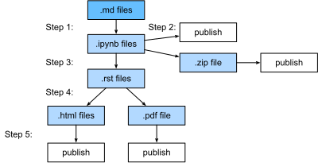

# Build pipeline

The source files are markdown files. They are either purely markdown files or
juypyter notebooks saved in the markdown format with output removed. For the
latter, we may use Jupyter to edit them directly with the `notedown` plugin and
then run "Kernel -> Restart & Clear Output" before committing.

Then our building pipeline runs the following steps to publish the artifacts.

1. Convert .md files into .ipynb files and evaluate each of them. The reason that
   we use .md file as source format is because it's easy to review the source
   changes. We evaluate every time to guarantee every notebook is
   executable. This evaluation step may be time consuming, we can

   - Assume every notebook can be executed in 10 minutes, we may use multiple
     GPUs to accelerate the execution
   - If the source .md file hasn't change since last evaluation, we can reuse
     the cached .ipynb file to avoid execution again.
   - We use multiple processes to run notebooks in parallel.

1. The .ipynb files with outputs can be uploaded to Github directly so users can
   clone it to run them locally or on the cloud. Also we zip all files so users
   can download it easily

1. These .ipynb files are then converted to .rst files with format compatible to
   Sphinx. Additional preprocessing steps are used for image/table/citation
   references.

1. Use Sphinx to build .html and .pdf files

1. Publish all .html/.pdf/.zip files online, such as into an AWS S3 bucket.
