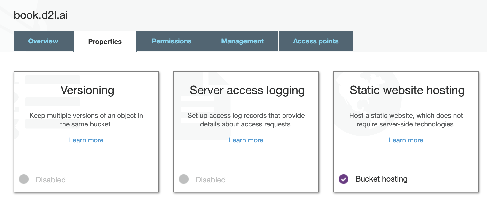
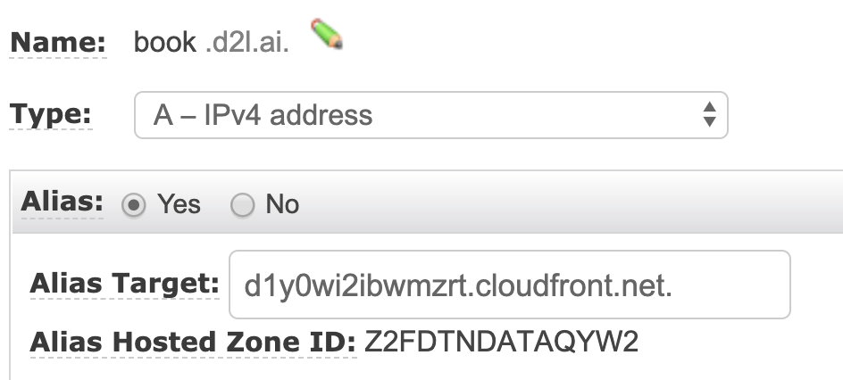

# Deploying

You can copy the built result to any of your favorite places that can serve content online. Otherwise `d2lbook` provides two ways to deploy your build results: deploying through [Github](http://github.com/) or through [AWS](https://aws.amazon.com/).

## Deploying Through Github

[Github Pages](https://pages.github.com/) allow us to host a website through a Github repo. To do so, we first need to create a github repo, for example we created [d2l-ai/d2l-book-deploy-demo](https://github.com/d2l-ai/d2l-book-deploy-demo) for this example. Then enable serving from the master branch in `Settings -> GitHub Pages`. You will get a URL to access it. It is [d2l-ai.github.io/d2l-book-deploy-demo](https://d2l-ai.github.io/d2l-book-deploy-demo/) for this example. You can add anything to `README.md`, which will not show on the website.


:width:`400px`

Now let's create a project with `[deploy] github_repo` specified and build both HTML and PDF. You will see a large amount of logging information thanks to LaTeX,  more exactly, `xelatex`.

```{.python .input}
!mkdir -p deploy
```

```{.python .input}
%%writefile deploy/index.md
# Deploying Demo for d2lbook

This is a demo to deploy on Github.

````toc
get_started
````
```

```{.python .input}
%%writefile deploy/get_started.md
# Getting Started

Please first install my favorite package `numpy`.
```

```{.python .input}
%%writefile deploy/config.ini
[project]
name = deply-demo

[html]
header_links = PDF, https://https://d2l-ai.github.io/d2l-book-deploy-demo/deply-demo.pdf, fas fa-file-pdf

[deploy]
github_repo = d2l-ai/d2l-book-deploy-demo
```

```{.python .input}
!cd deploy; d2lbook build html pdf
```

To deploy to Github, you need to have your machine's [SSH key imported to Github](https://github.com/settings/keys). Otherwise, you may need to type in your account and password. When it is done, you can assess the results online in one or two minutes. For this example, the URL is [/d2l-ai.github.io/d2l-book-deploy-demo/](https://d2l-ai.github.io/d2l-book-deploy-demo/).

```{.python .input}
!cd deploy; d2lbook deploy html pdf
```

Lastly, let's clean our workspace.

```{.python .input}
!rm -rf deploy
```

## Deploying Through AWS

Another supported option is deploying through AWS. This option provides more flexibility but requires you to know the basic usage of AWS.

We recommend the following procedure for the deployment:

1. Copying results into [S3](https://aws.amazon.com/s3/).
2. Serving with a [CDN](https://en.wikipedia.org/wiki/Content_delivery_network) by using [CloudFront](https://aws.amazon.com/cloudfront/) to reduce the latency.
3. Buying and adding a customized domain at [Route 53](https://aws.amazon.com/route53/)

Now let's walk through these three steps one-by-one. Before getting started, you need to have a valid AWS account and type in your [AWS access key](https://docs.aws.amazon.com/IAM/latest/UserGuide/id_credentials_access-keys.html) by running `aws configure`.

First, create a S3 bucket. You can use the targeted domain name as your bucket name. For example, this site is deployed at book.d2l.ai, then we created a bucket with the name `book.d2l.ai`. In addition, we need to disable blocking public access through ACLs when creating this bucket, see :numref:`fig_s3-acl` and enable static website hosting, see :numref:`fig_s3-web-hosting`. Then you will get a URL to access this bucket. In our example, it's http://book.d2l.ai.s3-website-us-west-2.amazonaws.com/.


:label:`fig_s3-acl`
:width:`500px`



:label:`fig_s3-web-hosting`
:width:`500px`

Second, create a new CloudFront distribution, by specifying the following options:
- Origin Domain Name: the previous S3 URL without `http://`, e.g. `book.d2l.ai.s3-website-us-west-2.amazonaws.com`
- Default Root Object: `index.html`
- [optional] Alternate Domain Names (CNAMEs): your target domain name, e.g. `book.d2l.ai`
- [optional] SSL Certificate: you can create one in [Certificate Manager](https://aws.amazon.com/certificate-manager/) and then select it.

After a few minute, we will obtain the domain name such as `d1y0wi2ibwmzrt.cloudfront.net`.

Third, you can either buy a domain at Route 53 or add Route 53's DNS into your existing domain. After that, create a "Hosted Zone" and then a Type-A Record Set with the CoundFront domain name as the alias target, see :numref:`fig_record-set` for an example.



:label:`fig_record-set`
:width:`350px`

Once you are done, specify your S3 bucket name in the following `config.ini` entry.

```bash
[deploy]
s3_bucket = s3://book.d2l.ai
```

Each time you run `d2lbook deploy`, all results will be synchronized to this bucket and deployed automatically. Note that since we enabled a CDN, any new change may take a while to be shown in your URL (e.g. http://book.d2l.ai). But you can check the S3 bucket URL (e.g. http://book.d2l.ai.s3-website-us-west-2.amazonaws.com) to review the changes immediately.
