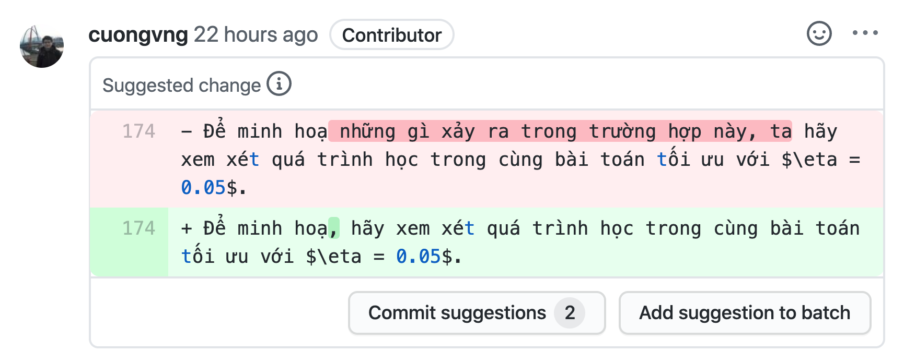
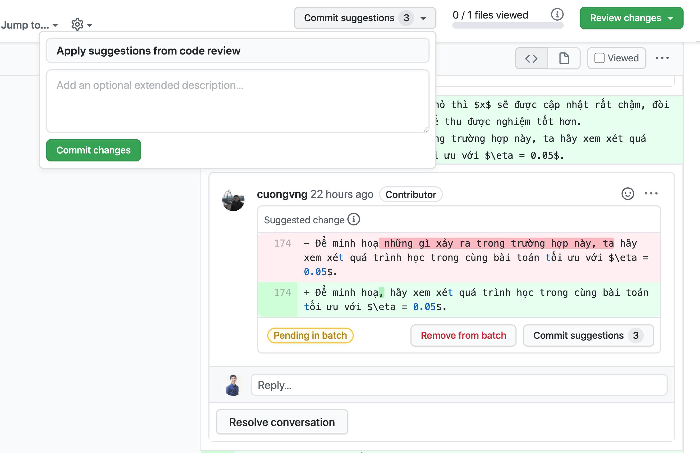

# Những vấn đề thường gặp

## Dành cho Người đóng góp (Contributors)

### Quy trình làm việc của một thành viên sẽ như thế nào?

Chúng tôi gợi ý một quy trình làm việc tuần tự với người dịch thuật như sau:
1. Bạn nhận một Issue mới về dịch (Bạn được nhận khi bạn được assign, chưa assign là chưa nhận), bạn nên nhận những Issue đã được chúng tôi public trước đó, thường là nằm dưới cùng trong danh sách các Issue có gán nhãn `status: help wanted`.

2. Bạn thực hiện dịch và đẩy một Pull request lên dự án để được review. Một PR được xem là sẵn sàng review khi bạn chọn Create pull request để mở một PR, nếu bạn chưa sẵn sàng review cho PR này, hãy chọn Draft Pull Request để mở PR.

3. Khi bạn nhận được review từ các thành viên trong nhóm thì bạn giúp mình xem qua để solve các phản hồi bạn đồng ý, thảo luận các phản hồi chưa đồng ý. Điểm chính khi bạn có nhiều hơn 2 PR đang ở trên dự án thì ưu tiên của bạn là xử lý những PR được mở trước đó, sau đó mới đến những phần dịch mới.

Bạn luôn có thể nhận thêm phần dịch, tuy nhiên hãy làm tuần tự để đảm bảo rằng phần PR đã lên luôn được up-to-date, tránh việc có nhiều thành viên vào review và quá nhiều ý kiến thì phần cập nhật sẽ bị sót (chất lượng review sẽ giảm).

### Tôi có bao nhiêu thời gian để hoàn thành phần dịch mình đã nhận?

Hiện tại, chúng tôi hy vọng bạn sẽ hoàn thành phần dịch trễ nhất là 4 ngày kể từ ngày nhận, tức càng sớm càng tốt.

### Tôi tiếp nhận những phản hồi từ nhóm phản biện như thế nào?

Khi phần nội dung của bạn được đưa lên Pull request, nhóm phản biện sẽ có những thành viên vào và đưa ra những gợi ý, đề xuất chỉnh sửa giúp cho nội dung của bạn đúng hơn về mặt thông tin, trôi chảy hơn về mặt hành văn.

Để xem toàn bộ gợi ý từ người phản biện, bạn vào phần tab `File changed` để chắc chắn mình nhìn thấy đầy đủ toàn bộ gợi ý mà không bị sót.

Ở mỗi phần gợi ý, hãy cân nhắc về sự đồng tình của bạn đối với gợi ý đó. Nếu bạn đồng tình với những đề xuất của người phản biện, bạn hãy `Add suggestion to batch`; nếu bạn chưa đồng tình với đề xuất, vui lòng phản hồi lại để thảo luận với người phản biện nhằm tìm ra giải pháp phù hợp cuối cùng.

Sau khi hoàn tất việc kiểm tra, phản hồi thì bạn chọn ở nút `Commit suggestions` theo hình và nhấn `Commit changes` để cập nhật những thay đổi. Với cách này, bạn không phải cập nhật thủ công những phần gợi ý của người phản biện và tiết kiệm được nhiều thời gian của bạn cho dự án hơn.

Riêng về vấn đề trao đổi, thảo luận với người phản biện, chúng tôi đề xuất bạn ít nhất để lại một reaction đối với những gợi ý mà họ để lại; điều này giúp cho người phản biện và chúng tôi biết bạn đã xem nội dung hay chưa, có đồng tình hay không.

### Tôi muốn hỗ trợ kỹ thuật?

Bạn vui lòng liên hệ [@duythanhvn](https://github.com/duythanhvn) thông qua Github issue hoặc Slack để thảo luận thêm.

### Tôi đã có kinh nghiệm làm việc với Github.

Thật tuyệt vời, bạn có thể bắt đầu nhanh hơn vào phần nội dung của cuốn sách mà không mất nhiều thời gian để làm quen lại với Github.

Trong trường hợp bạn đã có một vài kinh nghiệm trong việc sử dụng Git, chúng tôi gợi ý bạn xem qua **[hướng dẫn đóng góp vào một dự án Github](https://codetot.net/contribute-github/)** một cách kỹ thuật hơn.

Chúng tôi cũng có một số gợi ý về phần mềm để bạn có được hiệu quả cao nhất:
* [Visual Studio Code](https://code.visualstudio.com/)
* [Github Desktop](https://desktop.github.com/)
* [Git for Windows, macOS & Linux](https://git-scm.com/download/)

Một số plugins chuyên dụng cho VS Code bạn có thể sử dụng trong dự án gồm:
* [GitHub Pull Requests and Issues](https://marketplace.visualstudio.com/items?itemName=GitHub.vscode-pull-request-github)
* [LaTeX Workshop](https://marketplace.visualstudio.com/items?itemName=James-Yu.latex-workshop)
* [Markdown All in One](https://marketplace.visualstudio.com/items?itemName=yzhang.markdown-all-in-one)

### Phần tôi dịch trông không giống bản gốc ở website d2l.ai?

Chúng tôi khuyến khích bạn khi dịch thì bám sát vào nội dung chúng tôi đã cung cấp trong tập tin, mọi sự thay đổi và cập nhật chúng tôi sẽ có hành động cụ thể sau. 

Điều này đặc biệt lưu ý vì ở bản tiếng Anh, nhóm tác giả luôn có những cập nhật lớn nhỏ; ở bản tiếng Việt này chúng tôi sẽ chủ động kiểm tra và có những phản ứng phù hợp, đôi khi sự thay đổi của bản gốc không ảnh hưởng đến nội dung hiện thời, chúng tôi cũng không có chủ trương cập nhật.

Vì vậy, bạn hãy dịch dựa trên nội dung mà nhóm đã cung cấp trong tập tin nhé.

### Tôi thấy hình ảnh ở phần tôi dịch chưa được chuyển ngữ, tôi cần phải làm gì?

Ở mỗi chương, chúng tôi có tập hợp lại những hình ảnh cần chuyển ngữ vào một Github Issue để cả nhóm có thể nắm và thực hiện. Bạn có thể tham gia vào hoạt động này (hoặc không). Nếu bạn mong muốn tham gia, vui lòng xem qua hướng dẫn chi tiết **[tại đây](https://github.com/aivivn/d2l-vn/blob/master/img/README.md)**.

## Dành cho nhóm Cộng tác (Collaborators)

### Tôi có thể merge PR của mình không?

Không, chúng tôi khuyến khích các thành viên tham gia dự án chỉ nên tập trung vào phần dịch thuật và trao đổi dịch thuật mà thôi. Nhóm điều phối sẽ kiểm tra các PR và tiến hành merge khi đã đạt yêu cầu.

### Khi là Collaborator, tôi có thể làm những gì?

Bạn có thể có gần như tất cả các quyền mà những thành viên khác trong nhóm có. Bạn có thể tự assign mình vào một issue, bạn có thể gắn label cho các pull request, bạn có thể approve các pull request...

Tuy nhiên, để loại bỏ những bận tâm không đáng có, chúng tôi chỉ khuyến nghị bạn tập trung vào phần nội dung mà thôi: dịch những nội dung đã nhận, phản biện những nội dung của các thành viên khác, nêu quan điểm trong các thảo luận về thuật ngữ; đó là tất cả những gì dự án cần (và hạn chế mọi điều ở trên chúng tôi có liệt kê).

