# Hướng dẫn edit ảnh bằng phần mềm Inkscape

Phần này sẽ hướng dẫn các bạn cách đưa những từ đã được dịch vào ảnh bằng phần mềm [Inkscape](https://inkscape.org/) là một phần mềm
cho phép chỉnh sửa ảnh svg miễn phí. Trong phần này, ta sẽ sử dụng ảnh `wake-word.svg làm ví dụ`

Đầu tiên, khi mở Inkscape, bạn sẽ gặp một giao diện giống như bên dưới

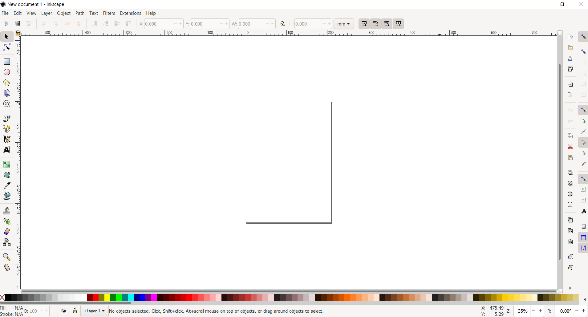

Chúng ta sẽ mở ảnh mà mình muốn chỉnh sửa bằng cách vào `File -> Open`

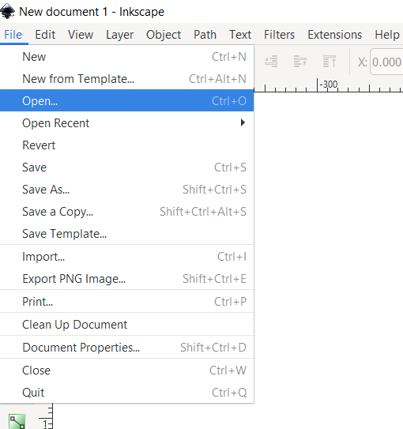

Và ta sẽ được giao diện bên dưới

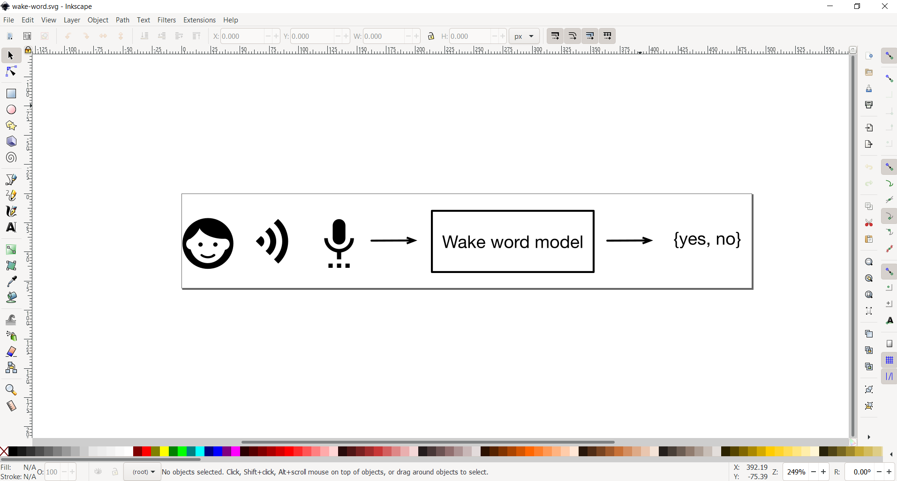

Vì tệp svg được cấu thành từ nhiều tag khác nhau nhằm hướng dẫn việc vẽ, nên công việc chỉnh sửa của chúng ta chỉ là **thêm các tag văn bản
chứa phần dịch tiếng Việt** và **xóa các tag văn bản tiếng Anh tương ứng**. Để làm điều đó, trước hết chúng ta phải mở trình chỉnh sửa XML trên Inkscape.

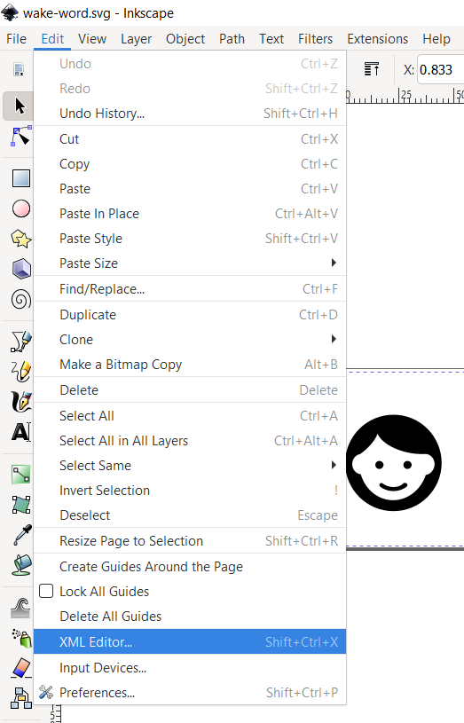

Như bạn đã thấy, hình ảnh của chúng ta có 2 tag lớn chính. Tuy nhiên, nội dung ảnh của chúng ta sẽ nằm trong tag "surface1"

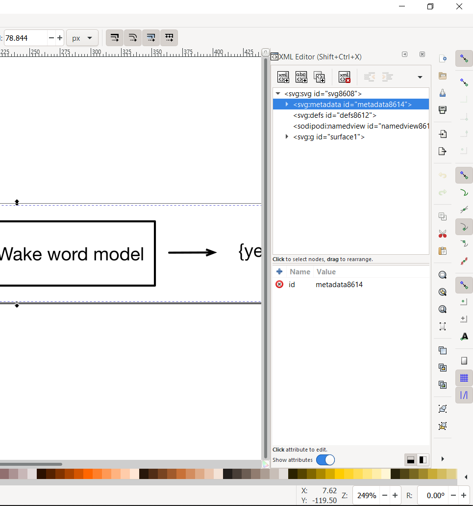

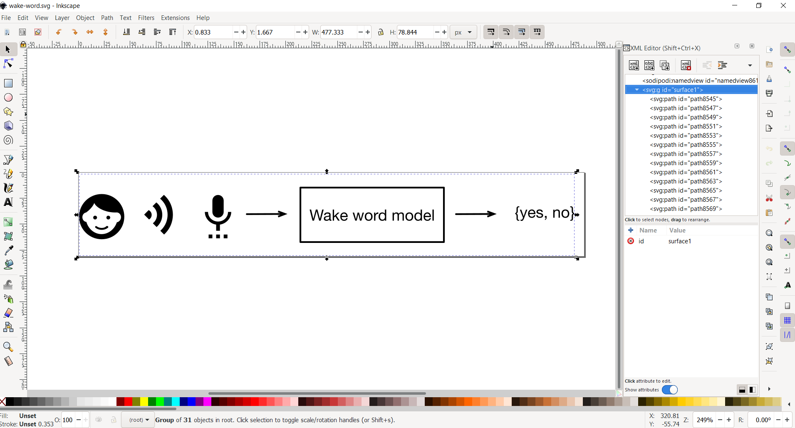

Lúc này, bạn có thể duyệt qua một vài tag con trong đó. Như bạn có thể thấy, mỗi tag con sẽ tương ứng với một hoặc nhiều nét ở trong hình

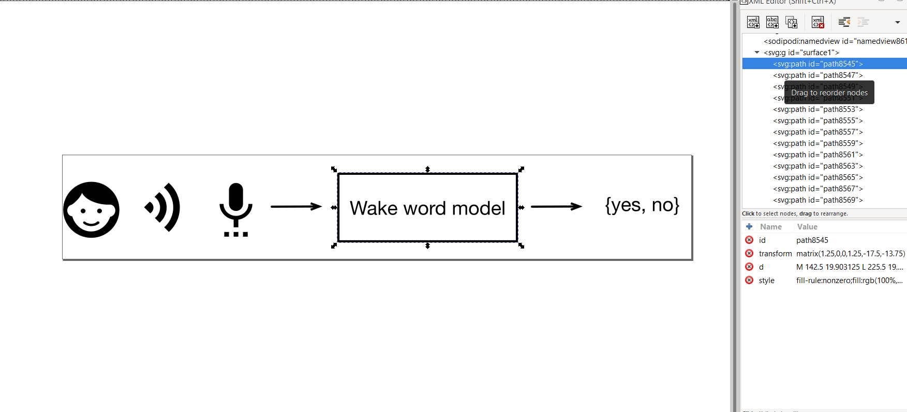

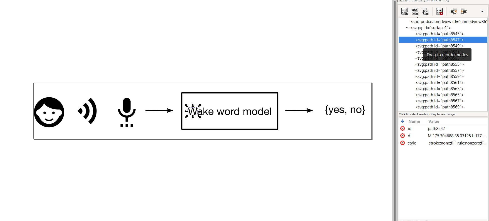

Để bắt đầu việc thêm tag văn bản, ta phải chuyển qua chế độ thêm văn bản trên Inkscape

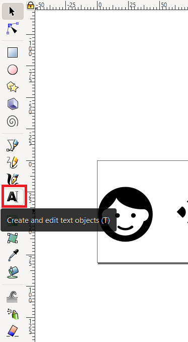

Sau đó nhấn ở một chỗ bất kỳ trên hình sẽ xuất hiện một khung văn bản, và lúc này bạn đã có thể nhập ký tự vào khung đó. Đồng thời, các lựa chọn
về chỉnh sửa font, kích thước, màu, canh lề cũng xuất hiện trên thanh công cụ của Inkscape. Ta đã có thể bắt đầu chọn những tham số font và kích thuớc
phù hợp với văn bản trong ảnh gốc.

Có một mẹo nhỏ mà mình hay làm đó là đánh lại câu trong văn bản gốc và chỉnh đến khi nào 2 văn bản hoàn toàn trùng khớp khi đè lên nhau hoặc khi để bên cạnh nhau.

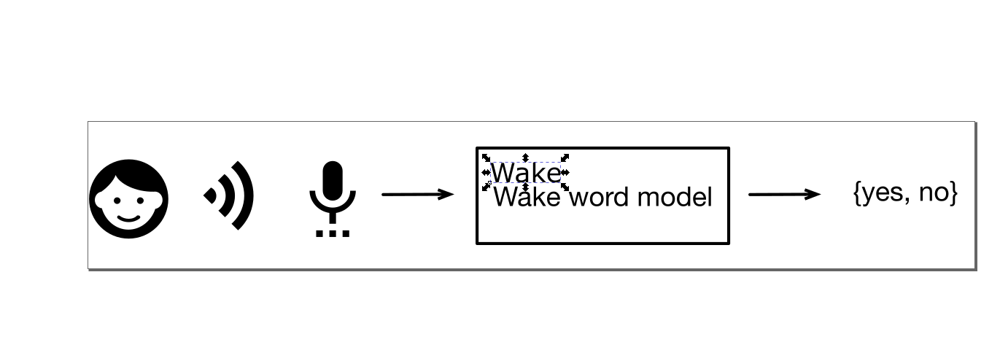

Có một điều nên lưu ý là khi ở trong chế độ chỉnh sửa văn bản, chúng ta **không thể** di chuyển thẻ vòng quanh. Để làm được điều đó, ta phải quay
trở lại chế độ bình thường

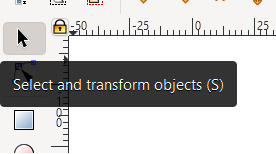

Sau đó, ta có thể đưa văn bản dịch vào vị trí tương ứng

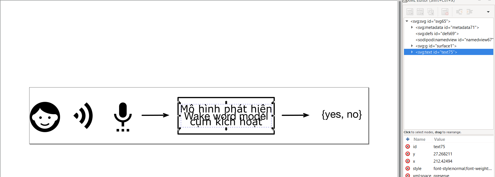

Tuy nhiên, để bảo đảm rằng những gì chúng ta thêm vào sẽ di chuyển cùng những phần còn lại. Ta cần cho nó làm một tag con của "surface1" bằng cách
chọn tag mới thêm và chọn "Indent node"

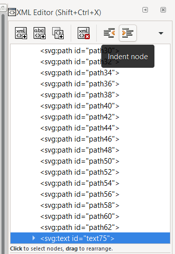

Cuối cùng, chúng ta chỉ cần xóa những tag liên quan đến phần văn bản chúng ta đã dịch bằng cách chọn và nhấn vào "Delete node"

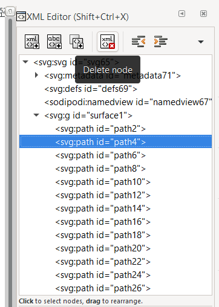

Và đây là thành quả cuối cùng

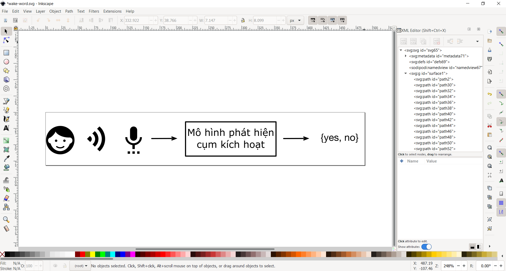

À, đừng quên lưu lại đấy!

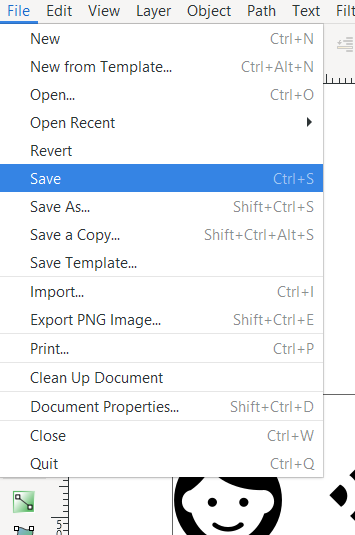

<b>Happy editing!</b>
