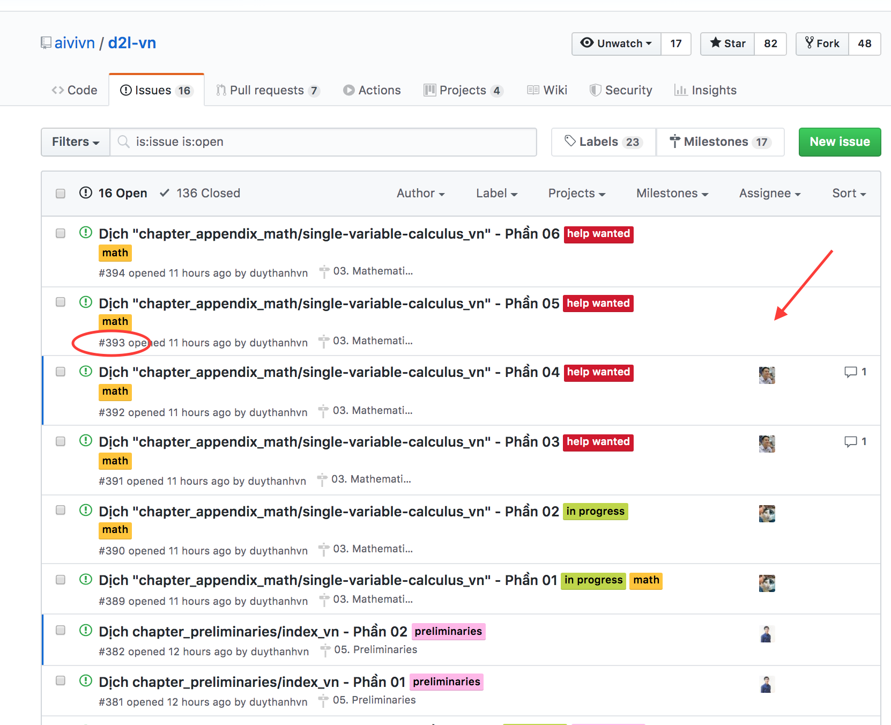

## Hướng dẫn dịch trực tiếp trên trình duyệt

### Bước 1: Chọn phần cần dịch
Tới [tab issue](https://github.com/aivivn/d2l-vn/issues), tìm xem issue nào chưa có người dịch, tức cột Assignee còn trống như trong hình dưới đây:

### Một vài quy tắc dịch:
* Không dịch các danh từ riêng
* Không dịch code
* Không nhất thiết phải dừng từng từ từng câu nhưng phải dịch đúng ý.
* Các thuật ngữ cần được dịch một cách nhất quán
* Nếu một thuật ngữ chưa có trong bảng thuật ngữ, bạn có thể đề xuất một cách dịch bằng cách tạo một PR mới
